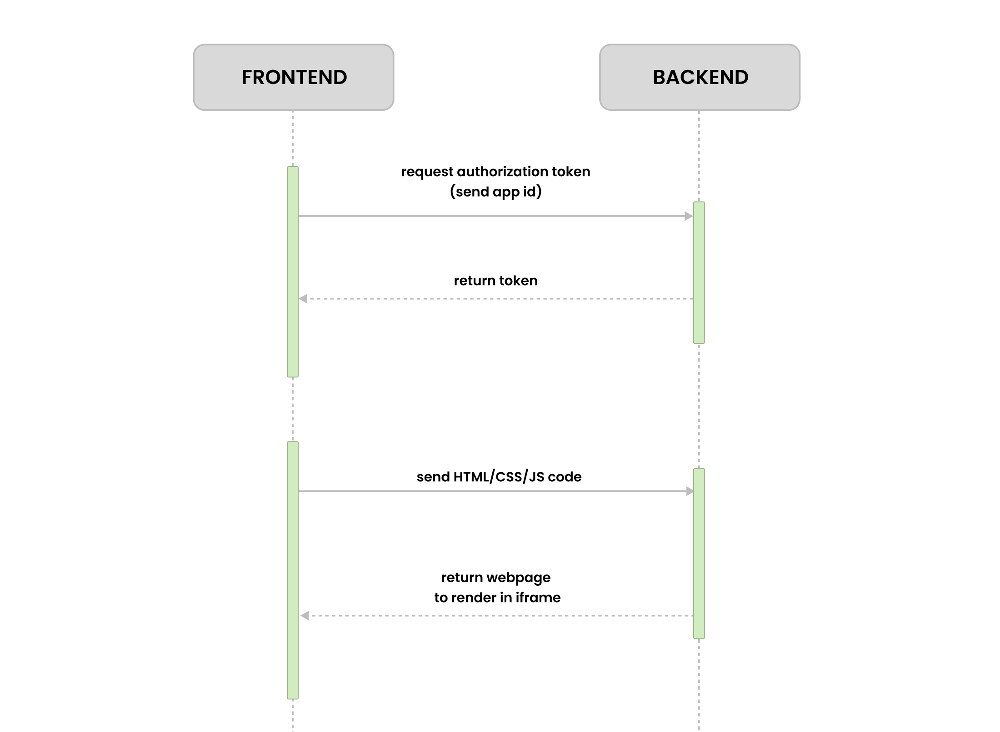

# Web Playground (codepen like app)

### Build Status:  

### Link: [visit website](https://noppytinto-web-playground.netlify.app)

 

## Description:

Web Playground is a Codepen like website, that allow users to write HTML/CSS/JS code and see the result into the browser.
The code is delivered to the backend and then persisted in a local session. The backend is responsible for authorize the app to render the code and to manage sessions.
The communication between front and backend takes place through Rest API.

 

## Stack:

- HTML, CSS (SASS)
- Javascript
(server)
- Node
- Express
- Postgres (session)

 

## Technologies:

- Webpack
- Netlify
- Heroku
- JWT token
- Rest API
- Codemirror

 

## Sequence Diagram (frontend-backend):

